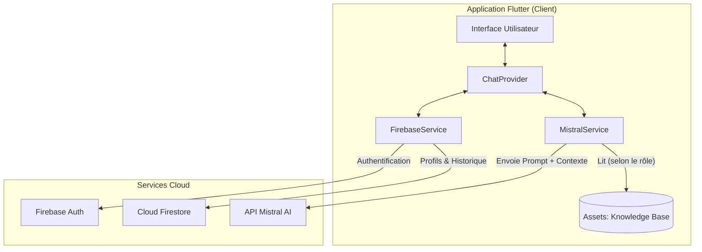
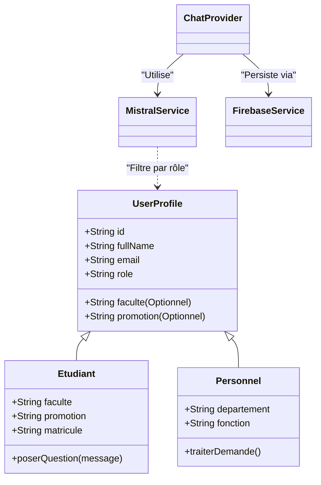
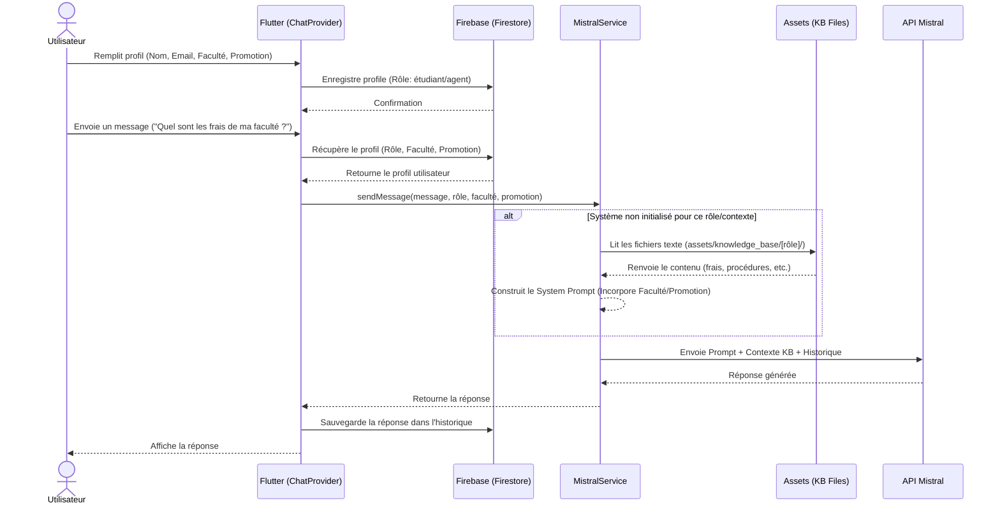

# Modélisation du Système - Chatbot UWB (Université William Booth)

Ce document présente la modélisation technique et fonctionnelle du système de chatbot intelligent de l'UWB, intégrant l'IA Mistral et les services Firebase.

## 1. Architecture Globale (Diagramme de Composants)

L'architecture repose sur une application Flutter client qui orchestre les interactions entre l'utilisateur, la base de connaissances locale, Firebase pour les données persistantes, et l'API Mistral pour le traitement du langage naturel.



## 2. Diagramme des Cas d'Utilisation

Ce diagramme identifie les principaux acteurs et leurs interactions avec le système.

```mermaid
usecaseDiagram
    actor "Étudiant" as etudiant
    actor "Agent Inscription" as agent
    actor "Rectorat / Décanat" as autorite
    
    package "Système Chatbot UWB" {
        usecase "S'authentifier" as UC_Auth
        usecase "Poser une question" as UC_Chat
        usecase "Consulter son profil" as UC_Profile
        usecase "Consulter l'historique des conversations" as UC_History
        usecase "Gérer la base de connaissances (Admin)" as UC_Admin_KB
    }
    
    etudiant --> UC_Auth
    etudiant --> UC_Chat
    etudiant --> UC_Profile
    
    agent --> UC_Auth
    agent --> UC_Chat
    agent --> UC_History
    
    autorite --> UC_Auth
    autorite --> UC_Chat
    autorite --> UC_History
```

## 3. Diagramme de Classes (Structure Logique)

Modélisation des services et des modèles de données principaux, montrant la séparation des responsabilités.



## 4. Diagramme de Séquence : Relation KB & Firebase

Ce diagramme illustre le flux critique où le rôle de l'utilisateur (stocké dans Firebase) définit le contexte de la base de connaissances (Knowledge Base) envoyé à l'IA.



## 5. Relation Base de Connaissances - Firebase

| Composant | Rôle | Interaction |
| :--- | :--- | :--- |
| **Firebase (Firestore)** | **Source de Vérité Utilisateur** | Stocke le `role` de l'utilisateur (ex: 'etudiant', 'agent_inscription'). Ce rôle est la clé de filtrage. |
| **Knowledge Base (Assets)** | **Source de Vérité Académique** | Dossiers locaux contenant les documents officiels segmentés par dossiers nommés selon les rôles. |
| **Mistral Service** | **Médiateur Inteligent** | Utilise le `role` venant de Firebase pour charger dynamiquement les fichiers de la `Knowledge Base`. |

> **Note :** Cette architecture garantit que l'IA ne répond qu'avec des informations certifiées et pertinentes pour le rôle, la faculté et la promotion de l'utilisateur connecté via Firebase.

## 6. Synthèse des Flux (Input / Output)

### Inputs (Entrées)
- **Authentification** : Email, Mot de Passe.
- **Profil Étudiant** : Nom Complet, Rôle (Étudiant), **Faculté** (ex: Médecine, Polytechnique), **Promotion** (ex: L1, L2).
- **Requête** : Message texte saisi dans le chat.

### Outputs (Sorties)
- **Réponse IA** : Texte généré par Mistral filtré par le contexte académique (Knowledge Base) spécifique à la faculté/promotion.
- **Persistance** : Historique des messages sauvegardé dans Cloud Firestore.
- **Navigation** : Redirection vers le tableau de bord ou la vue profil.
