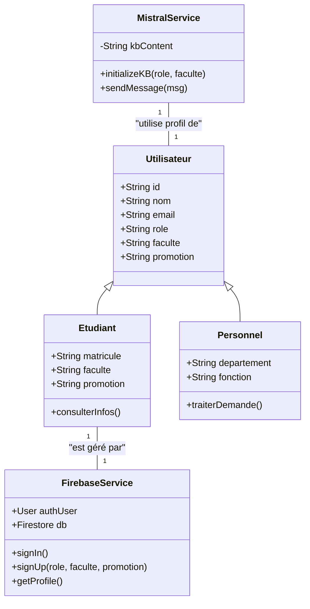
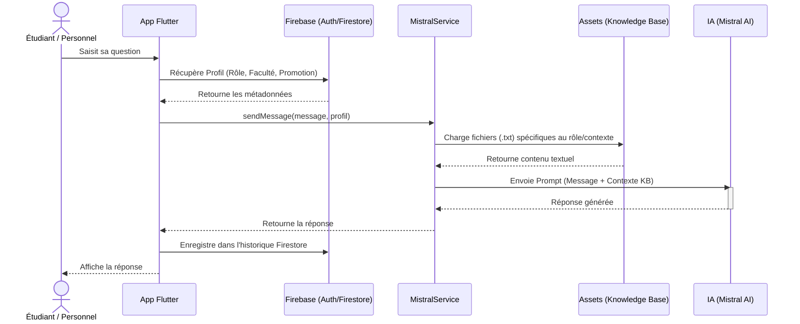

# Diagrammes UML - Plateforme Conversationnelle UWB

Ce document présente la modélisation UML complète du système, incluant les cas d'utilisation pour tous les rôles, le diagramme de classes mis à jour avec Firebase, et les flux de séquence avec l'IA Mistral.

## 1. Diagramme des Cas d'Utilisation (Use Case Diagram)

Ce diagramme illustre les interactions entre la diversité des acteurs de l'UWB et le système central.

```mermaid
usecaseDiagram
    actor "Étudiant" as etudiant
    actor "Rectorat" as rectorat
    actor "Service Académique" as service_aca
    actor "Décanat" as decanat
    actor "Agent Inscription" as agent_ins
    actor "Agent Finance" as agent_fin
    actor "Agent Contrôle Dossier" as agent_ctrl
    actor "Autres" as autres
    
    package "Système Chatbot UWB" {
        usecase "S'authentifier" as UC_Auth
        usecase "Poser une question (IA)" as UC_Chat
        usecase "Consulter Profil & Historique" as UC_History
        usecase "Consulter Procédures Spécifiques" as UC_Proc
        usecase "Générer Rapports Performance" as UC_Stats
    }
    
    etudiant --> UC_Auth
    etudiant --> UC_Chat
    etudiant --> UC_History
    
    rectorat --> UC_Auth
    rectorat --> UC_Chat
    rectorat --> UC_Stats
    
    service_aca --> UC_Auth
    service_aca --> UC_Chat
    service_aca --> UC_Proc
    
    decanat --> UC_Auth
    decanat --> UC_Chat
    
    agent_ins --> UC_Auth
    agent_ins --> UC_Chat
    agent_ins --> UC_Proc
    
    agent_fin --> UC_Auth
    agent_fin --> UC_Chat
    
    agent_ctrl --> UC_Auth
    agent_ctrl --> UC_Chat
    
    autres --> UC_Auth
    autres --> UC_Chat
```

---

## 2. Diagramme de Classes (Class Diagram)

Modélisation de l'architecture logicielle articulée autour de Firebase et du service Mistral.



---

## 3. Diagramme de Séquence : Flux RAG (Retrieval Augmented Generation)

Interaction entre l'utilisateur, l'application Flutter, Firebase et l'API Mistral avec injection de la base de connaissances (Knowledge Base).



---

## 4. Relation Données et Connaissance

| Rôle Utilisateur (Firebase) | Dossier Base de Connaissances (Assets) |
| :--- | :--- |
| Étudiant | `assets/knowledge_base/etudiant/` |
| Rectorat | `assets/knowledge_base/rectorat/` |
| Service Académique | `assets/knowledge_base/service_academique/` |
| Décanat | `assets/knowledge_base/decanat/` |
| Agent Inscription | `assets/knowledge_base/agent_inscription/` |
| Agent Finance | `assets/knowledge_base/agent_finance/` |
| Agent Contrôle Dossier | `assets/knowledge_base/agent_controle_dossier/` |
| Autres | `assets/knowledge_base/autres/` |
