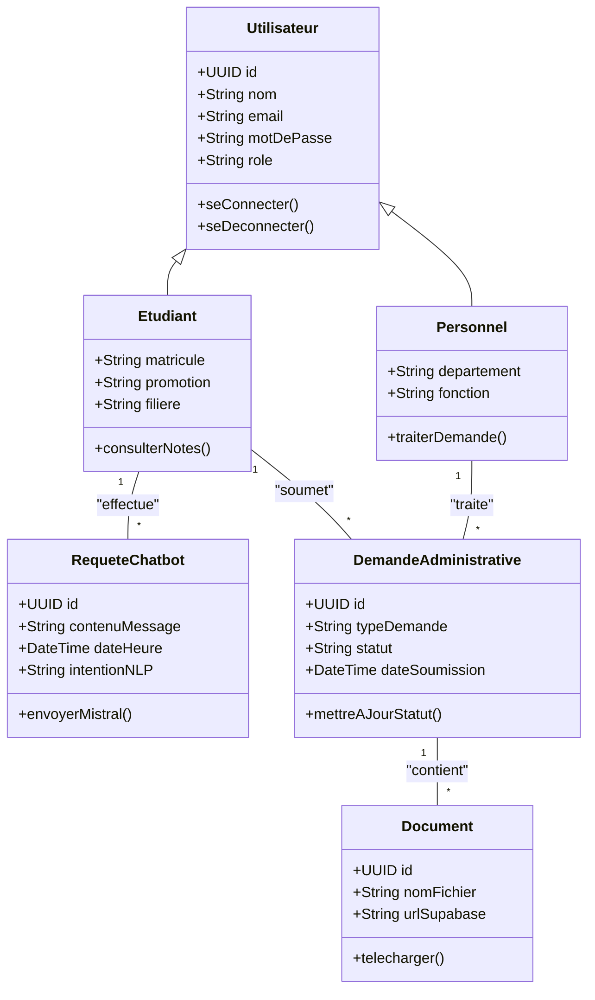
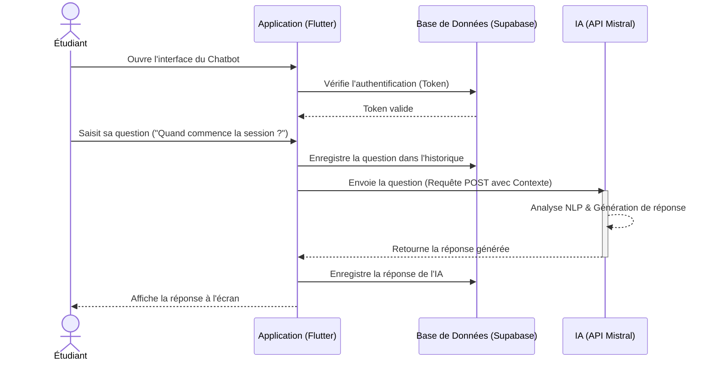

# Diagrammes UML - Plateforme Conversationnelle UWB

Voici les diagrammes UML basés sur la méthode du Processus Unifié (UP) décrite dans votre introduction. Vous pouvez inclure ces diagrammes dans le **Chapitre 3** de votre mémoire.

## 1. Diagramme des Cas d'Utilisation (Use Case Diagram)
Ce diagramme illustre les interactions entre les différents acteurs et le système.

```mermaid
usecaseDiagram
    actor "Étudiant" as etudiant
    actor "Personnel Administratif" as admin
    actor "Autorité Académique" as autorite
    
    package "Plateforme UWB" {
        usecase "S'authentifier" as UC_Auth
        usecase "Poser une question (Chatbot)" as UC_Chat
        usecase "Consulter les résultats/horaires" as UC_Consult
        usecase "Soumettre une demande (Attestation...)" as UC_Demande
        usecase "Gérer les demandes" as UC_Manage_Demandes
        usecase "Mettre à jour la base de connaissances" as UC_Update_KB
        usecase "Consulter le tableau de bord décisionnel" as UC_Dashboard
        usecase "Générer des indicateurs de performance" as UC_Stats
    }
    
    etudiant --> UC_Auth
    etudiant --> UC_Chat
    etudiant --> UC_Consult
    etudiant --> UC_Demande
    
    admin --> UC_Auth
    admin --> UC_Manage_Demandes
    admin --> UC_Update_KB
    
    autorite --> UC_Auth
    autorite --> UC_Dashboard
    autorite --> UC_Stats
    
    UC_Demande ..> UC_Auth : <<include>>
    UC_Chat ..> UC_Auth : <<include>>
    UC_Dashboard ..> UC_Auth : <<include>>
```

---

## 2. Diagramme de Classes (Class Diagram)
Ce diagramme modélise la structure de la base de données et l'architecture orientée objet du système.



---

## 3. Diagramme de Séquence : Interaction avec le Chatbot
Ce diagramme montre la chronologie des messages lors d'une interaction entre l'étudiant, l'application Flutter, la base de données (Supabase) et l'Intelligence Artificielle (Mistral).


